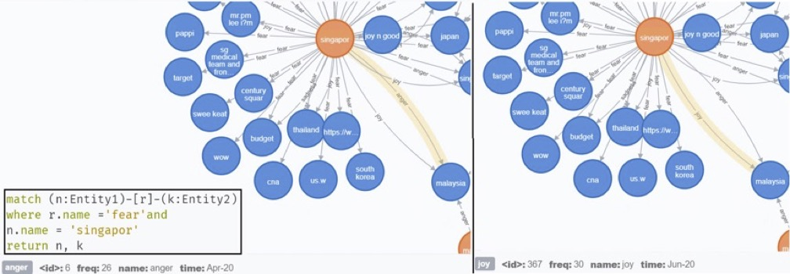

# Adv-ML
Term Project for Adv. Machine Learning Course (CS 6216), NUS

## Social Media Knowledge Graphs for Social Scientists

#### Data Collection, Processing, & KG Creation

### Temporal KG in Neo4j

Temporal KG for the months of April and June showing graph where the fear emotion is prominant.

### Sentiment Graph (Senaph)

Sentiment Graph generation from raw data. The 6-dimentional sentiment vector on the edges represents the sentiments associated with nodes

TransE plots generated from Sentiment Graphs for the emotion 'fear' (colored in blue) for different months.

